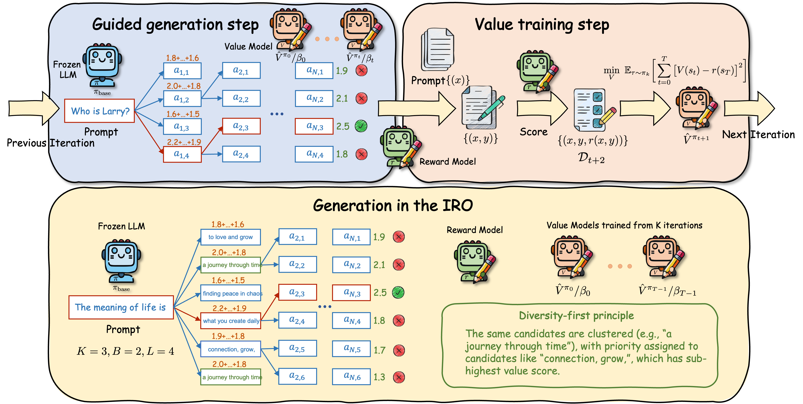
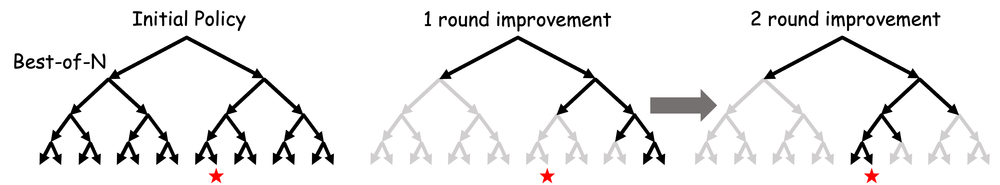
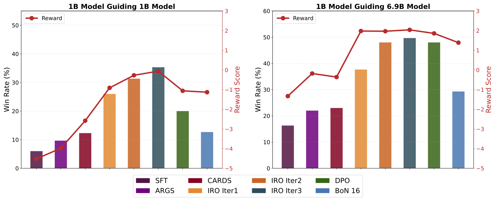
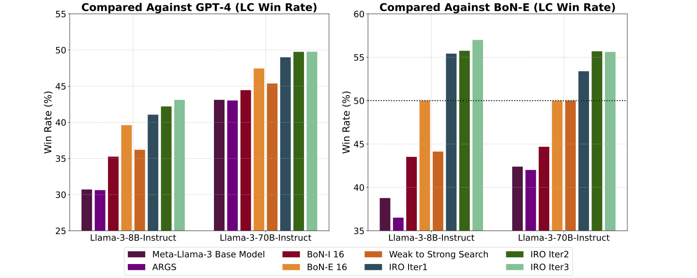
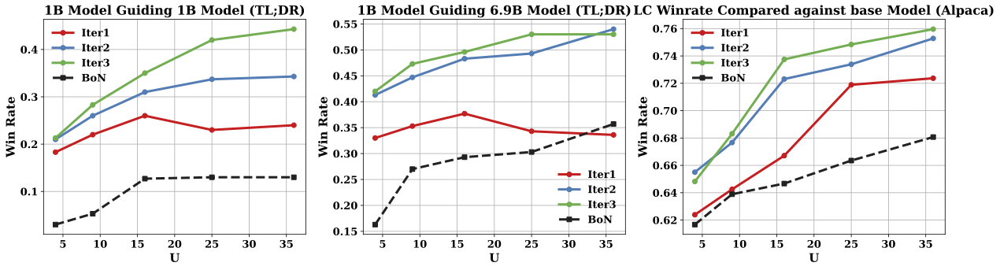

# Aligning Frozen LLMs by Reinforcement Learning: An Iterative Reweight-then-Optimize Approach

<div align="center">

[](https://arxiv.org/pdf/2506.17828)
[](https://www.python.org/)
[](https://pytorch.org/)
[](LICENSE)

*A reinforcement learning framework for aligning frozen LLMs without parameter updates*

</div>

---

## 📖 Table of Contents

- [Overview](#-overview)
- [Key Features](#-key-features)
- [Experimental Results](#-experimental-results)
- [Quick Start](#-quick-start)
- [Usage Examples](#-usage-examples)
- [Acknowledgement](#-acknowledgement)
- [Citation](#-citation)

---

## 🔍 Overview

This repository contains the official implementation of **IRO (Iterative Reweight-then-Optimize)**, introduced in our paper: ["Aligning Frozen LLMs by Reinforcement Learning: An Iterative Reweight-then-Optimize Approach"](https://arxiv.org/pdf/2506.17828).

### 🎯 What is IRO?

IRO is a novel reinforcement learning framework that performs RL-style alignment of frozen base models **without modifying their parameters**. The method works through an iterative process:

1. **Sample** candidates from the base model
2. **Resample** using current value functions  
3. **Train** a new lightweight value function for the next iteration

At test time, the trained value functions guide the base model generation via a search-based optimization process.

<div align="center">

<p><em>Illustration of the IRO algorithm</em></p>
</div>

### 🚀 Key Advantages

- **Parameter-efficient**: No updates to the frozen base model
- **Sample-efficient**: More efficient than Best-of-N methods
- **Iterative improvement**: Progressive policy enhancement through value function training

<div align="center">

<p><em>IRO demonstrates superior sample efficiency compared to Best-of-N methods</em></p>
</div>

---

## 🎯 Key Features

- ✅ **Frozen Model Alignment**: Align LLMs without parameter updates
- ✅ **Iterative Training**: Progressive improvement through multiple iterations  
- ✅ **Value Function Guidance**: Lightweight value functions guide generation
- ✅ **Sample Efficiency**: Better performance with fewer samples than baseline methods
- ✅ **Multiple Tasks**: Support for summarization and instruction-following tasks

---

## 📊 Experimental Results

### TL;DR Summarization Task
<div align="center">

<p><em>Performance comparison on TL;DR summarization task</em></p>
</div>

### Instruction-Following Task  
<div align="center">

<p><em>Results on instruction-following evaluation</em></p>
</div>

### Test-Time Scaling
<div align="center">

<p><em>Test-time scaling behavior with value function guidance</em></p>
</div>

---

## 🚀 Quick Start

### Prerequisites

- **Python**: 3.10+
- **CUDA**: Compatible GPU with CUDA 11.8+
- **Conda**: For environment management

### 🔧 Installation

#### Environment for Decoding
```bash
# Create and activate decoding environment
conda create -n decoding python=3.10
conda activate decoding

# Install PyTorch with CUDA support
pip install torch=2.1.0 --index-url https://download.pytorch.org/whl/cu118

# Install dependencies
pip install -r requirements.txt

# Optional: Install flash attention for better performance
pip install flash-attn==2.3.2 --no-build-isolation
```

#### Environment for Value Function Training
```bash
# Create environment from YAML file
conda env create -f env_value_train.yaml
```

---

## 💡 Usage Examples

### 📝 TL;DR Summarization Task

#### Model Configuration
Use 1B value function with 1B frozen policy. For 6.9B base model, update this line in all scripts:
```bash
base_model=vwxyzjn/EleutherAI_pythia-6.9b-deduped__sft__tldr
```

#### Training Pipeline

**Step 1: Generate Initial Data**
```bash
# Generate data from frozen policy π_base
bash scripts/tldr/rollout_iter0.sh
```

**Step 2: Train Value Function**
```bash
# Train the first value function
bash scripts/tldr/value_train_iter1.sh
```

**Step 3: Evaluate with Guidance**
```bash
# Evaluate π_1 generation on test data
bash scripts/tldr/run_guiding_iter1.sh
```

**Step 4: Continue Iterations**
```bash
# Iteration 2
bash scripts/tldr/rollout_iter1.sh
bash scripts/tldr/value_train_iter2.sh
bash scripts/tldr/run_guiding_iter2.sh

# Iteration 3
bash scripts/tldr/rollout_iter2.sh
bash scripts/tldr/value_train_iter3.sh
bash scripts/tldr/run_guiding_iter3.sh
```

#### Evaluation with GPT

Add the following to `scripts/tldr/run_guiding_iter.sh` for win-rate evaluation:
```bash
export OPENAI_API_KEY='your_openai_api_key'

python scripts/tldr/gpt_evaluate.py \
    --input_path ${save_dir}
```

#### Baseline Comparisons
```bash
# Run baseline methods
bash scripts/tldr/run_args.sh    # Argumentation
bash scripts/tldr/run_base.sh    # Base model
bash scripts/tldr/run_bon.sh     # Best-of-N
bash scripts/tldr/run_dpo.sh     # DPO
```

---

### 🎓 Instruction Following Task

#### Training with 7B Value Function + 8B Frozen Policy

**Step 1: Generate Initial Data**
```bash
# Generate data from frozen policy π_base
bash scripts/instruction_following/7b_scripts/roll_out_8b_iter1.sh
```

**Step 2: Train Value Function**
```bash
# Train the first value function
bash scripts/instruction_following/7b_scripts/value_train_iter1.sh
```

**Step 3: Evaluate with Guidance**
```bash
# Evaluate π_1 generation on test data
bash scripts/instruction_following/7b_scripts/run_valueguding_iter1.sh
```

**Step 4: Continue Iterations**
```bash
# Iteration 2
bash scripts/instruction_following/7b_scripts/roll_out_8b_iter2.sh
bash scripts/instruction_following/7b_scripts/value_train_iter2.sh
bash scripts/instruction_following/7b_scripts/run_valueguding_iter2.sh

# Iteration 3
bash scripts/instruction_following/7b_scripts/roll_out_8b_iter3.sh
bash scripts/instruction_following/7b_scripts/value_train_iter3.sh
bash scripts/instruction_following/7b_scripts/run_valueguding_iter3.sh
```

#### AlpacaEval Evaluation
```bash
# Activate evaluation environment
conda activate alpacaEval

# Run AlpacaEval comparison against GPT-4
alpaca_eval --model_outputs ${save_dir}/train_merge_reward.json \
    --output_path ${save_dir} \
    --reference_outputs ${reference_outputs}
```

#### Baseline Comparisons
```bash
# Run baseline methods
bash scripts/instruction_following/7b_scripts/run_args.sh      # Argumentation
bash scripts/instruction_following/7b_scripts/run_base_8b.sh   # Base model
bash scripts/instruction_following/7b_scripts/run_BoN_8b.sh    # Best-of-N
bash scripts/instruction_following/7b_scripts/run_cbs_8b.sh    # CBS
```

---

## 🙏 Acknowledgement

Our implementation builds upon excellent open-source projects:
- [**TL;DR Summarization**](https://github.com/vwxyzjn/summarize_from_feedback_details) - Foundational summarization framework
- [**Weak-to-Strong Search**](https://github.com/ZHZisZZ/weak-to-strong-search) - Search-based optimization techniques

We sincerely appreciate the contributions of these teams to the open-source research community.

---

## 📑 Citation

If you find this work helpful, please consider citing our paper:

```bibtex
@article{zhang2025aligning,
  title={Aligning Frozen LLMs by Reinforcement Learning: An Iterative Reweight-then-Optimize Approach},
  author={Zhang, Xinnan and Li, Chenliang and Zeng, Siliang and Li, Jiaxiang and Wang, Zhongruo and Lin, Kaixiang and Lu, Songtao and Garcia, Alfredo and Hong, Mingyi},
  journal={arXiv preprint arXiv:2506.17828},
  year={2025}
}
```

---

<div align="center">

**[⬆ Back to Top](#aligning-frozen-llms-by-reinforcement-learning-an-iterative-reweight-then-optimize-approach)**

</div>